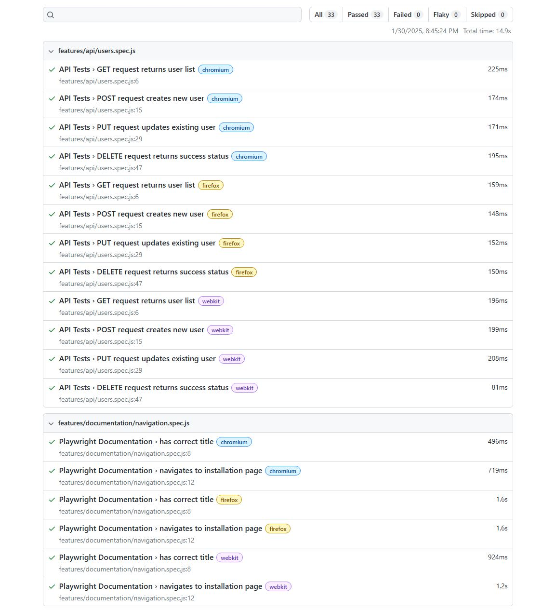

# Playwright Test Suite

End-to-end testing suite demonstrating various testing capabilities with Playwright.

## Quick Start

```bash
# Install dependencies
npm install

# Install browsers
npx playwright install

# Run all tests
npx playwright test

# Run tests with UI mode
npx playwright test --ui
```

## Test Structure

```
tests/
├── features/
    ├── api/
    │   └── users.spec.js         # API testing examples
    ├── documentation/
    │   └── navigation.spec.js    # Playwright docs tests
    ├── forms/
    │   └── contact.spec.js       # Form interaction tests
    ├── search/
    │   └── google.spec.js        # Search functionality tests
    └── visual/
        └── layout.spec.js        # Visual testing examples
```

## Test Results

Latest test execution results:



## Test Coverage

### API Tests (`api/users.spec.js`)
- GET request validation
- POST request testing
- JSON response handling
- PUT request updates
- DELETE request handling

### Documentation Tests (`documentation/navigation.spec.js`)
- Playwright website navigation
- Title verification
- Installation page access

### Form Tests (`forms/contact.spec.js`)
- Todo item creation
- Checkbox interaction
- Form state validation

### Search Tests (`search/google.spec.js`)
- Google search functionality
- Human-like interaction patterns
- Results verification

### Visual Tests (`layout.spec.js`)
- Screenshot comparison
- Responsive layout testing
- Multiple viewport sizes

## Running Specific Tests

```bash
# Run API tests
npx playwright test tests/features/api/

# Run form tests
npx playwright test tests/features/forms/

# Run single test file
npx playwright test tests/features/search/google.spec.js
```

## View Test Reports

```bash
npx playwright show-report
```

## Configuration

Browser settings and test options are configured in `playwright.config.js`. Current setup includes:
- Chromium, Firefox, and WebKit browsers
- Parallel test execution
- HTML report generation
- Network request handling 